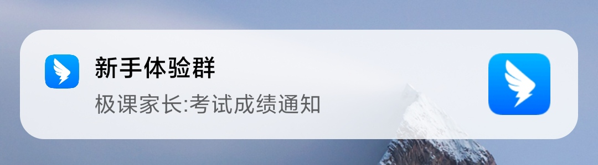
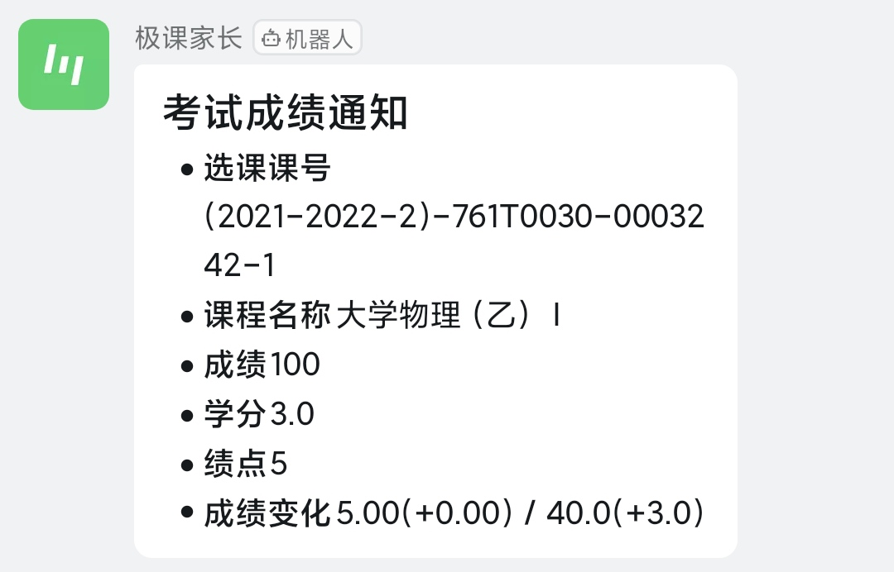

# ZJUScoreAssistant

这是一个非常 naive 的命令行成绩助手，用于成绩查询、GPA 计算、成绩更新通知等等。

## 运行

从仓库中下载 zip 压缩包并解压或 git 该仓库到自己的电脑上。使用 `python zjuscore.py -h` 即可查看帮助。

## 使用说明

我们可以通过以下参数使用成绩助手：

```powershell
python zjuscore.py [-h] [-i username password] [-u] [-ls [YEAR [SEMESTER ...]]] [-n NAME [NAME ...]]
                   [-g [YEAR [SEMESTER ...]]] [-d [DingWebhook]] [-dn]
```

### 获取帮助

使用 `-h` 或 `--help` 参数即可获取帮助。

```powershell
PS > python zjuscore.py -h
usage: zjuscore.py [-h] [-i username password] [-u] [-ls [YEAR [SEMESTER ...]]] [-n NAME [NAME ...]]
                   [-g [YEAR [SEMESTER ...]]] [-d [DingWebhook]] [-dn]

ZJU Score Assistant

options:
  -h, --help            show this help message and exit
  -i username password, --initial username password
                        initialize your information
  -u, --update          update the course score
  -ls [YEAR [SEMESTER ...]], --list [YEAR [SEMESTER ...]]
                        list the course and score in a certain year/semester
  -n NAME [NAME ...], --name NAME [NAME ...]
                        search score by the name of the course
  -g [YEAR [SEMESTER ...]], --gpa [YEAR [SEMESTER ...]]
                        calculator the gpa
  -d [DingWebhook], --ding [DingWebhook]
                        set your DingTalk Robot Webhook. Empty means disabled
  -dn, --dnotification  enable dingtalk score notification
```

### 初始化成绩助手

首先我们需要让成绩助手知道我们的浙大统一身份认证平台的账号密码，才能获取到成绩信息。因此，我们需要通过 `-i` 或 `--initial` 参数来初始化，其后需要跟上两个参数 `用户名（学号）` 和 `密码`。程序在初始化时会自动校验您的用户名和密码。

```powershell
PS > python zjuscore.py -i 1234 56
Invalid username or password. Please check them again and use -i to reset them.

PS > python zjuscore.py -i 320010**** **********
Initial Success!
```

### 更新成绩

我们可以通过参数 `-u` 或 `--update` 来更新储存在当前电脑上的成绩。这是为了避免每次查询成绩都必须重新查询而浪费时间的情况。

```powershell
PS > python zjuscore.py -u
Updated Success!
```

### 成绩查询

通过 `-ls` 或 `--list` 参数来查询成绩。成绩查询支持以下三种使用方式：

- `python zjuscore.py -ls` 可查询本人的所有的成绩。

- `python zjuscore.py -ls <学年>` 可查询某一学年的成绩。您可将 `<学年>` 替换为 `2021` 或 `2021-2022` 来查询 2021-2022 学年的所有课程成绩。

- `python zjuscore.py -ls <学年> <学期>` 可查询某一学期的成绩。您可将 `<学年>` 替换为 `2021` 或 `2021-2022`，并将 `<学期>` 替换为 `春` `夏` `秋` `冬` 以及 `春夏` `秋冬` 等来查询 2021-2022 学年某一学期的所有课程成绩。

例如：

```powershell
PS > python zjuscore.py -ls
Semeter         Name                    Mark    GP      Credit
2021-2022 春夏  离散数学及其应用           60      1.5     4.0
2021-2022 夏    社会主义发展史            79      3.3     1.5
......

PS > python zjuscore.py -ls 2021
Semeter         Name                    Mark    GP      Credit
2021-2022 春夏  离散数学及其应用           60      1.5     4.0
......

PS > python zjuscore.py -ls 2021 夏
Semeter         Name                    Mark    GP      Credit
2021-2022 夏    社会主义发展史             79      3.3     1.5
```

除此之外，您也可以通过 `-n` 或 `--name` 以根据课程名称搜索成绩信息。

```powershell
PS > python zjuscore.py -n 离散
Semeter         Name                    Mark    GP      Credit
2021-2022 春夏  离散数学及其应用           60      1.5     4.0

PS > python zjuscore.py -n 微寄分 大物
Semeter         Name                    Mark    GP      Credit
2021-2022 春夏  微积分（甲）Ⅱ             80      3.3     5.0
2021-2022 秋冬  微积分（甲）Ⅰ             80      3.3     5.0
2021-2022 春夏  大学物理（乙）Ⅰ           80      3.3     3.0

PS > python zjuscore.py --name 汇编
Cannot find any course matching keyword(s) 汇编
```

### 均绩计算

通过 `-g` 或 `--gpa` 来获取某一特定时间段的均绩。其用法与 `-ls` 参数用法一致。

```powershell
PS > python zjuscore.py -g     
Your GPA during the whole college is 3.95

PS > python zjuscore.py -g 2021
Your GPA during the academic year of 2021-2022 is 3.95

PS > python zjuscore.py -g 2021 夏
Your GPA during the semester of 2021-2022 夏 is 3.90
```

### 成绩更新通知

在启用前，您需要使用 `-d` 或 `--ding` 来设置钉钉群机器人的 Webhook URL：

- `python zjuscore.py -d https://oapi.dingtalk.com/robot/send?access_token=xxxxxxxxxx` 设置钉钉群机器人的 Webhook URL。

- `python zjuscore.py -d` 重置钉钉群机器人的 Webhook URL。这意味着您可以通过这个命令来关闭钉钉机器人的成绩更新通知。

在配置钉钉群机器人时，您可以遵循以下步骤：

1. 在钉钉的新手体验群中添加自定义机器人。
2. 在自定义机器人的安全设置中，设置关键词为 `成绩`。
3. 复制钉钉机器人提供的 Webhook URL 并通过 `-d` 参数配置到本应用中。

之后，使用 `python zjuscore.py -dn` 或 `python zjuscore.py -dnotification` 即可启用成绩更新通知。该应用会持续运行，每隔 1 - 5 分钟自动从教务网同步成绩以获取更新的成绩信息，并将更新成绩通过钉钉群机器人推送至钉钉。

**注意** 为了更好的使用体验，推荐您使用该功能时将此应用放在服务器上运行。

一旦有更新的成绩，您的群机器人会自动推送如下信息：





### 参数连用

您可以连续使用多个参数来简化使用流程。例如：

- 使用 `python zjuscore.py -i 321010xxxx xxxxxxxx -u -g` 来初始化成绩助手并获取您的均绩。
- 使用 `python zjuscore.py -i 321010xxxx xxxxxxxx -d https://oapi.dingtalk.com/robot/send?access_token=xxxxxxxxxx -dn` 来初始化成绩更新提醒服务并启用通知。
- 使用 `python zjuscore.py -u -n xxx` `python zjuscore.py -u -ls` 或 `python zjuscore.py -u -ls` 使得本应用每次查询成绩信息时都会从教务网重新同步信息。